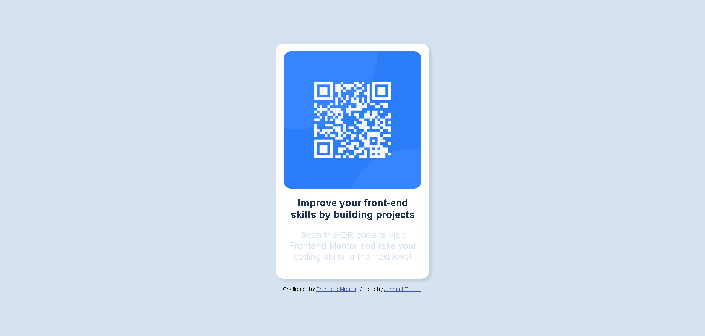

# Frontend Mentor - QR code component solution

This is a solution to the [QR code component challenge on Frontend Mentor](https://www.frontendmentor.io/challenges/qr-code-component-iux_sIO_H). Frontend Mentor challenges help you improve your coding skills by building realistic projects. 

## Table of contents
  - [Screenshot](#screenshot)
  - [Links](#links)
- [My process](#my-process)
  - [Built with](#built-with)
  - [What I learned](#what-i-learned)
  - [Continued development](#continued-development)
  - [Useful resources](#useful-resources)
- [Author](#author)
- [Acknowledgments](#acknowledgments)

### Screenshot




### Links

- Solution URL: https://github.com/JohndelTorrizo/qr-code-component
- Live Site URL: https://johndeltorrizo.github.io/qr-code-component/
## My process

### Built with

- Semantic HTML5 markup
- CSS custom properties
- Flexbox

### What I learned

I learn an easier way to center a div.

```css
body {
    background-color: hsl(212, 45%, 89%);
    font-family: 'Outfit', sans-serif;
    display: flex;
    flex-direction: column;
    align-items: center;
    justify-content: center;
    height: 100vh;
}
```


### Continued development

I would like to improve my use of CSS flexbox and to practice more attributes. Making it easy to came up with solutions for my problems.

**Note: Delete this note and the content within this section and replace with your own plans for continued development.**

### Useful resources

- [https://medium.com/front-end-weekly/absolute-centering-in-css-ea3a9d0ad72e](https://medium.com/front-end-weekly/absolute-centering-in-css-ea3a9d0ad72e) - This gave me ideas on ways to center the div.
- [Example resource 2](https://www.w3schools.com/cssref/css3_pr_box-shadow.php) - This had helped me on how to put shadows, which adds depth to an object.


## Author

- Website - [JohndelTorrizo](https://github.com/JohndelTorrizo)
- Frontend Mentor - [@JohndelTorrizo](https://www.frontendmentor.io/profile/JohndelTorrizo)
- Twitter - [@JdTorrizo](https://twitter.com/JdTorrizo)


## Acknowledgments

Quick google searches and stackoverflow anwers for minor inconsistencies had helped me on this project.
